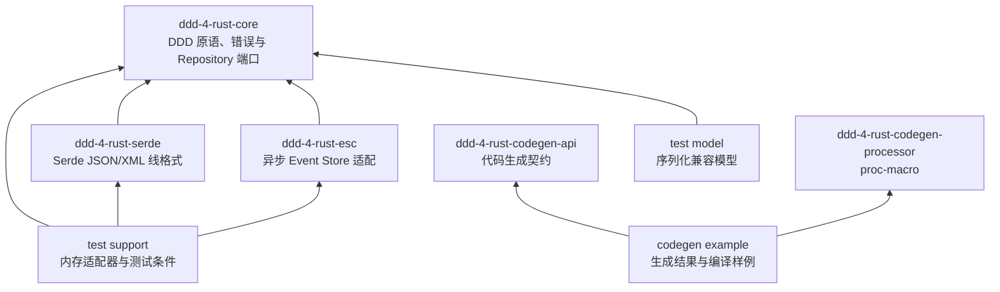
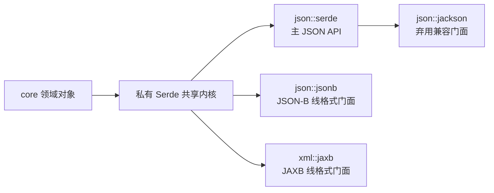
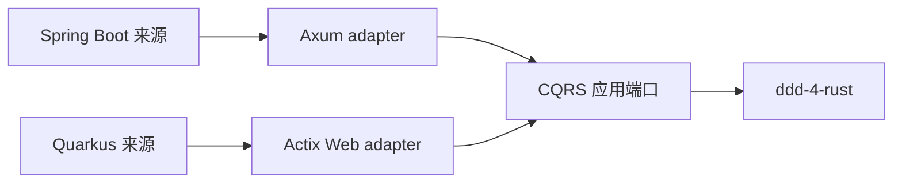

# ddd-4-rust 架构总览

本文描述 `ddd-4-java` 0.7.0 在 Rust 中的领域边界、依赖方向和框架
隔离规则。文件级迁移约束见
[IMPLEMENTATION_PLAN.md](./IMPLEMENTATION_PLAN.md)。

## 一、Workspace 分层



核心领域模型保持同步；`Repository` 和 Event Store 的 I/O 端口保持
异步。`esc` 不依赖 `serde`，事件存储契约不与具体线格式绑定。

## 二、Java 与 Rust 核心契约

| Java | Rust | crate |
|---|---|---|
| `Event` | `Event` trait | core |
| `DomainEvent<ID>` | `DomainEvent<ID>` trait | core |
| `EntityId` | `EntityId` trait | core |
| `AggregateRootId` | `AggregateRootId` trait | core |
| `AggregateRoot<ID>` | `AggregateRoot<ID>` trait | core |
| `Repository<ID, T>` | 异步 `Repository<ID, T>` trait | core |
| `AbstractAggregateRoot<ID>` | `AbstractAggregateRoot<ID>` | core |
| `ApplyEventHandler` | `ApplyEventHandler` trait | core |
| Java 异常 | 独立 Rust 错误 + `AggregateError` | core |
| `EventStoreRepository` | `EventStoreRepository` | esc |

事件分发使用结构化结果：

```text
ApplyEventHandler::try_apply_event
├── Ok(true)  → 事件已应用
├── Ok(false) → 没有处理器，由聚合根转换为 EventHandlerNotFound
└── Err(e)    → 处理器执行失败，保留具体错误
```

历史回放、构建校验、版本推进和 Event Store 操作均通过 `Result` 暴露
失败，不使用生产路径 `panic!` 表达可恢复错误。

## 三、序列化边界

Java 的 Jackson、JSON-B 和 JAXB 文件仍按来源一对一登记，Rust 运行时
统一建立在 Serde 上：



- Jackson 和 JSON-B 使用 `serde` + `serde_json`；
- JAXB 使用 `serde` + `quick-xml`；
- `json` 默认启用，`xml` 通过 feature 可选启用；
- `json::jackson` 不包含独立实现，也不引入 Jackson 运行时；
- typed ID、版本、异常数据、字段名、XML 标签和空值行为保持 Java
  0.7.0 线格式；
- `ZonedDateTimeValue` 同时保存 UTC 瞬时值和 IANA 时区名称。

## 四、注解处理器到 proc-macro

| Java | Rust | 编译期职责 |
|---|---|---|
| `@ApplyEvent` | `#[apply_event]` | 生成返回 `Result<bool, AggregateError>` 的事件分发 |
| `@ChildEntityLocator` | `#[child_locator]` | 生成子实体定位注册 |
| `@HasEntityTypeConstant` | `#[derive(EntityId)]` | 生成实体 ID 契约和类型常量 |
| 值对象处理器 | 值对象 derive | 生成校验、转换和构建接口 |
| 事件处理器 | `#[derive(DddEvent)]` | 生成事件及领域事件实现 |

`codegen/api` 保存契约，`codegen/processor` 只承担 proc-macro 展开，
`codegen/example` 保存生成结果和编译样例。失败分支由 trybuild 验证，
诊断必须定位到用户输入 token。

## 五、模块与命名

```text
crates/
├── core/
├── serde/
├── esc/
├── codegen/
│   ├── api/
│   ├── processor/
│   └── example/
└── test/
    ├── model/
    └── support/
```

- crate 目录保持简洁，源目录和文件使用 `snake_case`；
- Cargo 包名使用 `kebab-case`，Rust 类型使用 `PascalCase`；
- 模块采用 `foo.rs + foo/`，不使用 `mod.rs`；
- `lib.rs` 仅声明模块并定向重导出，不使用 glob 公开导出；
- 公开模块、对象、字段和方法均提供中文 rustdoc。

## 六、Web 框架隔离

当前冻结基线没有 Spring Boot 或 Quarkus 文件，因此 `ddd-4-rust`
Workspace 不依赖 Web 框架。后续 CQRS/示例迁移使用以下固定映射：



Axum 和 Actix Web 必须位于独立 CQRS adapter crate；路由、extractor、
HTTP 状态码和框架错误不得渗入本仓库的 `core`、`serde` 或 `esc`。

## 七、可发布边界

`codegen/example` 和 `test/model` 是 `publish = false` 的验证 crate。
其余公共 crate 按内部依赖顺序通过临时 Ktra 注册表验证，并由空白
Cargo 项目重新下载和编译，从而证明它们不依赖本地 Workspace 隐式状态。
