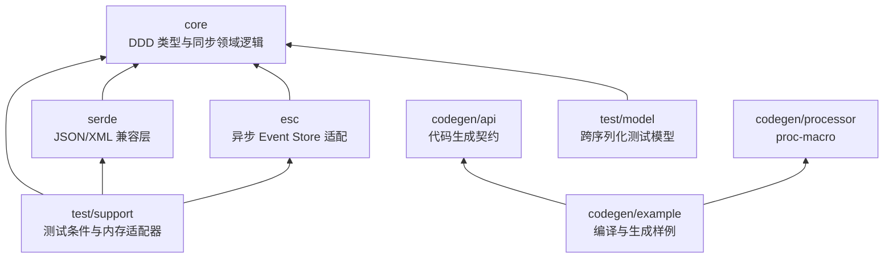

# ddd-4-java 0.7.0 → ddd-4-rust 实施基线

> 状态：410/410 个冻结基线文件均已实现并纳入测试。
> Java 基线：`ddd-4-java` 0.7.0，提交 `baa9a989`。
> 本文是当前迁移、目录结构和质量门禁的权威约束。

## 一、范围与验收口径

本轮只迁移 `ddd-4-java`。`cqrs-4-java` 和外部示例仓库不属于 410
文件基线，不允许为了引入 Web 框架而在本仓库虚构 Java 来源文件。

冻结提交共有 411 个 `.java` 文件，排除
`.mvn/wrapper/MavenWrapperDownloader.java` 后，强制映射基线为 410：

| 文件类别 | 数量 |
|---|---:|
| 生产源码 | 154 |
| 测试源码/测试辅助 | 233 |
| 生成源码 | 3 |
| 代码生成模板/黄金文件 | 20 |
| **总计** | **410** |

| Java 子域 | 一对一映射数 | 状态 |
|---|---:|---|
| core | 94 | 完成 |
| esc | 8 | 完成 |
| jackson | 81 | 完成 |
| jaxb | 76 | 完成 |
| jsonb | 77 | 完成 |
| jsonb-testmodel | 25 | 完成 |
| codegen | 47 | 完成 |
| junit | 1 | 完成 |
| jacoco | 1 | 完成 |
| **合计** | **410** | **完成** |

机器清单位于
[`migration/file_mapping.csv`](./migration/file_mapping.csv)，每行记录
`java_path`、`rust_path`、`file_kind`、`java_type`、`rust_type`、
`scenario_count`、`implementation_status`、`test_status` 和
`wire_fixture`。Rust 基础设施、模块入口、私有共享实现、Cargo 清单、
审计脚本和文档不计入 410。

严格审计必须保证：

- 恰好 410 行，两侧路径分别唯一；
- 每个目标文件存在、非空、已被模块树或 Cargo 测试入口发现；
- 不存在未登记的迁移文件，也不存在用空文件、注释或占位实现凑数；
- 233 个 Java 测试/辅助文件均有唯一 Rust 文件；
- Rust 场景计数不低于 Java 基线的 332 个 `@Test` 场景。

## 二、Workspace 结构

仓库采用 Edition 2024、resolver 3、MSRV 1.85 的虚拟 Workspace：

```text
ddd-4-rust/
├── Cargo.toml
├── Cargo.lock
├── crates/
│   ├── core/
│   ├── serde/
│   ├── esc/
│   ├── codegen/
│   │   ├── api/
│   │   ├── processor/
│   │   └── example/
│   └── test/
│       ├── model/
│       └── support/
├── docs/
└── tools/
```

目录职责和依赖方向如下：



`esc` 只依赖 `core`，不为未使用的线格式能力依赖序列化 crate。
`test/model` 只依赖 Core 和外部 Serde，不反向依赖
`ddd-4-rust-serde`，从而避免开发依赖环。

根清单集中维护 `[workspace.package]`、`[workspace.dependencies]` 和
`[workspace.lints]`。成员 crate 继承版本、Edition、MSRV、许可证和依赖
版本；内部可发布依赖同时声明路径、版本和本地注册表信息。

## 三、模块、文件与公开 API

- crate 目录使用简洁的 `core/`、`serde/`、`esc/`；
- 源码目录、模块、函数、字段和文件一律使用 `snake_case`；
- Cargo 包名使用 `kebab-case`；
- 类型、trait、enum 和 derive 宏使用 `PascalCase`；
- 采用现代 `foo.rs + foo/` 布局，禁止 `mod.rs`；
- `lib.rs` 只承担 crate 文档、模块声明和定向 `pub use`；
- 禁止 glob 公开重导出；
- 每个公开模块、对象、字段和方法必须有详细中文 rustdoc，说明职责、
  输入输出、状态变化或失败语义；
- 所有 crate 继承 `missing_docs = "deny"` 和
  `broken_intra_doc_links = "deny"`。

每个 Java 文件拥有唯一 Rust 映射文件。一个 Java 文件不得继续与其他
Java 文件合并在 `exceptions.rs`、`entity_type.rs` 等聚合文件中；统一
错误包装、共享解析逻辑和测试入口可以放在不计数的私有基础设施文件中。

## 四、Core 与 ESC 契约

- 每个 Java 异常对应独立的 PascalCase Rust 错误类型；
- `AggregateError` 作为稳定统一入口提供结构化包装和 `From` 转换；
- 历史回放、事件应用、构建校验、加解密和版本推进使用 `Result`，
  不在生产路径用 `panic!` 表达可恢复失败；
- `ApplyEventHandler` 返回 `Result<bool, AggregateError>`：
  - `Ok(true)`：事件已经应用；
  - `Ok(false)`：当前对象没有该事件的处理器；
  - `Err(error)`：处理器存在，但执行失败；
- 聚合根把 `Ok(false)` 转换成 `EventHandlerNotFound`；
- 领域对象保持同步，`Repository` 和 Event Store I/O 端口保持异步；
- ESC 覆盖读取、指定版本、追加、并发冲突、删除、缓存命中和底层错误映射。

## 五、序列化迁移

Java 中 Jackson、JSON-B 和 JAXB 的来源文件仍各自保留一对一映射，
但 Rust 生产实现统一使用 Rust 生态组件：

| Java 技术 | Rust 实现 | 说明 |
|---|---|---|
| Jackson | `serde` + `serde_json` | 完整替换 Jackson 运行时 |
| JSON-B | `serde` + `serde_json` | 保留 JSON-B 线格式兼容入口 |
| JAXB | `serde` + `quick-xml` | `xml` feature 可选启用 |

Serde crate 的结构为：

```text
crates/serde/src/
├── lib.rs
├── json.rs
├── json/
│   ├── serde.rs
│   ├── serde/
│   ├── jackson.rs
│   ├── jackson/
│   ├── jsonb.rs
│   └── jsonb/
├── xml.rs
└── xml/
    ├── jaxb.rs
    └── jaxb/
```

`json` 是默认 feature，`xml` 为可选 feature。主入口为
`ddd_4_rust_serde::json::serde`；`json::jackson` 仅作为标记弃用的
Java 命名兼容门面，所有行为委托给 Serde 实现，不引入 Jackson 依赖。
`ddd_4_rust_serde::AbstractEvent` 等既有入口通过定向重导出保持兼容。

线格式必须精确保持 typed ID、聚合版本、异常数据、事件字段名、空值、
相关/因果 ID、XML 标签和事件时间。`ZonedDateTimeValue` 同时保存 UTC
瞬时值和 `chrono_tz::Tz` 的 IANA 名称，确保 `Europe/Berlin`、DST、
非法时区和往返场景不会丢失区域信息。

## 六、Codegen 与测试

- `crates/codegen/api` 保存 6 个注解契约的 Rust 映射；
- `crates/codegen/processor` 使用 proc-macro 实现值对象、事件、
  实体 ID、`apply_event` 和 `child_locator`；
- 20 个 Java 模板迁为 Rust token 黄金结果；
- 3 个 `src-gen` 文件位于 `crates/codegen/example`；
- `codegen/example` 和 `test/model` 设置 `publish = false`；
- trybuild 覆盖合法展开、错误签名、重复处理器、未知事件、泛型、
  非法属性和生成代码编译失败，错误定位到输入 token；
- Core、Serde、ESC 单独以及整个 Workspace 的可执行行覆盖率必须为 100%
  （LCOV `DA:` 无 0 命中；由 `tools/check_lcov_full_coverage.py` 强制）。
  `cargo llvm-cov` 汇总 Lines 因 Rust/LLVM 对花括号与 derive/async 区域的
  统计偏差可略低于 100%，CI 以 `--fail-under-lines 98` 作为该汇总指标底线。

## 七、Web 框架映射边界

冻结的 `ddd-4-java` 提交中没有 Spring Boot 或 Quarkus 源文件，因此本
Workspace 不添加 Axum/Actix 依赖，也不把 Web 适配器计入 410。

后续迁移 `cqrs-4-java` 或对应示例仓库时固定采用：

| Java 框架 | Rust 框架 | 建议边界 |
|---|---|---|
| Spring Boot | Axum | 独立 `cqrs` Axum adapter crate |
| Quarkus | Actix Web | 独立 `cqrs` Actix adapter crate |

Web adapter 只能依赖 CQRS 应用端口，不得让 Axum/Actix 类型渗入
`core`、`serde` 或 `esc`。框架错误在 adapter 边界转换成统一应用错误
和 HTTP 响应。

## 八、依赖与质量门禁

直接依赖集中锁定为兼容 MSRV 1.85 的当前版本：

- `uuid 1.24.0`、`chrono 0.4.45`、`chrono-tz 0.10.4`；
- `serde 1.0.229`、`serde_json 1.0.151`、`quick-xml 0.41.0`；
- `thiserror 2.0.19`、`async-trait 0.1.91`、`inventory 0.3.24`；
- `syn 3.0.3`、`quote 1.0.47`、`proc-macro2 1.0.107`；
- `trybuild 1.0.118`、`proptest 1.11.0`。

提交根 `Cargo.lock`，CI 使用 `--locked`。Workspace 禁止 unsafe；Clippy
`all` 为 deny、`pedantic` 为 warn；生产代码禁止无说明的 `unwrap`、
`expect`、`panic`、`todo` 和 `unimplemented`。不可消除的重复依赖及
移除条件记录在
[`DEPENDENCY_EXCEPTIONS.md`](./DEPENDENCY_EXCEPTIONS.md)。

最终门禁：

```bash
python3 tools/audit_rust_conventions.py
python3 tools/audit_migration.py
cargo fmt --all -- --check
cargo check --workspace --all-targets --all-features --locked
cargo clippy --workspace --all-targets --all-features --locked -- -D warnings
cargo test --workspace --all-targets --all-features --locked
cargo test --workspace --doc --all-features --locked
RUSTDOCFLAGS="-D warnings" cargo doc --workspace --all-features --no-deps --locked
cargo llvm-cov --workspace --all-features --lcov --output-path target/lcov.info --fail-under-lines 98
python3 tools/check_lcov_full_coverage.py target/lcov.info
cargo deny check
cargo tree --workspace --duplicates
```

所有可发布 crate 还必须通过 `cargo package` 内容检查。CI 不向
crates.io 发布，而是启动临时 Ktra 注册表，按
`core → codegen-api → codegen-processor → serde → esc → test-support`
发布 0.7.0，再由空白项目从该注册表下载并执行 `cargo check`，证明包
能够脱离本地 Workspace 使用。
