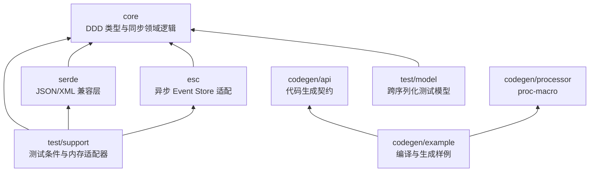

# ddd-4-rust 工作区分层与依赖方向设计

**日期**: 2026-07-23
**作用范围**: 仓库根 `Cargo.toml`、`crates/` 布局、所有成员 crate 的 `[dependencies]`。
**类型**: 长期架构事实。

---

## 1. 背景与目标

`ddd-4-java` 0.7.0 是一个 8 模块 Maven 多模块项目（`core` / `esc` / `jackson` /
`jaxb` / `jsonb` / `jsonb-testmodel` / `codegen` / `junit` / `jacoco`）。
Rust 重写必须保留同等的领域边界和依赖方向，避免把无关 crate 揉成
"超级 crate"。

## 2. Workspace 拓扑

```text
ddd-4-rust/
├── Cargo.toml           # 根清单：workspace.package、workspace.dependencies、workspace.lints
├── crates/
│   ├── core/            # DDD 原语、错误、Repository 端口（同步领域逻辑）
│   ├── serde/           # JSON / XML 线格式兼容层
│   ├── esc/             # 异步 Event Store 适配
│   ├── codegen/
│   │   ├── api/         # 代码生成契约
│   │   ├── processor/   # proc-macro 展开
│   │   └── example/     # 生成结果与编译样例（publish = false）
│   └── test/
│       ├── model/       # 序列化兼容模型（publish = false）
│       └── support/     # 测试条件与内存适配器
├── docs/
└── tools/
```

依赖方向必须严格遵循：



**强制约束**:

- `esc` 只依赖 `core`，不为未使用的线格式能力依赖序列化 crate。
- `test/model` 只依赖 `core` 和外部 Serde，不反向依赖 `ddd-4-rust-serde`，
  以避免开发依赖环。
- `codegen/api` 不依赖 `codegen/processor`；`codegen/processor` 只能依赖
  `codegen/api` 和外部 crate。
- 成员 crate 只能使用 `.workspace = true` 继承依赖，禁止各自声明版本。

## 3. 根清单集中维护项

根 `[workspace.package]`:

- `version = "0.7.0"`
- `edition = "2024"`
- `rust-version = "1.85"`
- `license = "LGPL-3.0-or-later"`

根 `[workspace.dependencies]` 锁定：

- `uuid 1.24.0` / `chrono 0.4.45` / `chrono-tz 0.10.4`
- `serde 1.0.229` / `serde_json 1.0.151` / `quick-xml 0.41.0`
- `thiserror 2.0.19` / `async-trait 0.1.91` / `inventory 0.3.24`
- `syn 3.0.3` / `quote 1.0.47` / `proc-macro2 1.0.107`
- `trybuild 1.0.118` / `proptest 1.11.0`

内部可发布依赖同时声明 `path`、`version` 与 `registry = "ddd4rust-local"`,
`codegen/example` 与 `test/model` 不参与注册表发布（`publish = false`）。

## 4. 可发布边界

```text
core → codegen-api → codegen-processor → serde → esc → test-support
```

每个公共 crate 必须经由临时 Ktra 注册表按依赖顺序发布 0.7.0；空白
Cargo 项目从该注册表下载并 `cargo check`，证明它们不依赖本地
Workspace 隐式状态。

## 5. 与 ddd-4-java 的对应

| Java 子域 | Rust crate | 状态 |
|---|---|---|
| `core` | `ddd-4-rust-core` | 完成 |
| `esc` | `ddd-4-rust-esc` | 完成 |
| `jackson` | `ddd-4-rust-serde::json::jackson` | 弃用兼容门面 |
| `jaxb` | `ddd-4-rust-serde::xml::jaxb` | feature `xml` |
| `jsonb` | `ddd-4-rust-serde::json::jsonb` | JSON-B 线格式 |
| `jsonb-testmodel` | `ddd-4-rust-test-model` | 序列化兼容模型 |
| `codegen` | `ddd-4-rust-codegen-{api,processor,example}` | proc-macro 重写 |
| `junit` / `jacoco` | `ddd-4-rust-test` | 测试支持（仅 1 个） |

冻结的 `ddd-4-java` 提交中没有 Spring Boot 或 Quarkus 文件，因此本
Workspace 不引入 Axum/Actix 依赖；后续 CQRS 迁移在独立 adapter crate
完成。