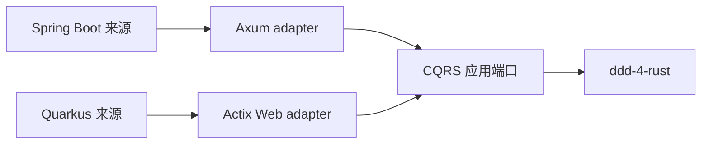

# Web 框架隔离设计

**日期**: 2026-07-23
**作用范围**: 全 Workspace（本设计文档不引入 Web 框架依赖，仅固化边界）。
**类型**: 长期架构事实。

---

## 1. 现状

冻结的 `ddd-4-java` 提交（`baa9a989`）中 **没有** Spring Boot 或
Quarkus 源文件。本 Workspace 不添加 Axum/Actix 依赖，也不把 Web
适配器计入 410 文件基线。

## 2. 后续 CQRS 迁移边界

后续 `cqrs-4-java` 或对应示例仓库迁移时固定采用：

| Java 框架 | Rust 框架 | 建议边界 |
|---|---|---|
| Spring Boot | Axum | 独立 `cqrs` Axum adapter crate |
| Quarkus | Actix Web | 独立 `cqrs` Actix adapter crate |

## 3. 不可违反约束

Web adapter 只能依赖 CQRS 应用端口（由后续 `cqrs-4-rust` 仓库定义）。
**禁止**让 Axum/Actix 类型渗入：

- `ddd-4-rust-core`
- `ddd-4-rust-serde`
- `ddd-4-rust-esc`

框架错误必须在 adapter 边界转换成统一应用错误和 HTTP 响应，不允许
把 `axum::Error` / `actix_web::Error` 透传到领域层。

## 4. 测试边界

Web adapter 测试属于 `cqrs-4-rust` 仓库，不在 ddd-4-rust 覆盖率
统计范围内。本 Workspace 的覆盖率门禁不包含任何 HTTP/REST 测试。

## 5. 何时解除

只有当以下条件全部满足时，才能在本 Workspace 引入 Web 框架：

1. 用户明确授权突破"冻结基线"约束；
2. CQRS 应用端口已稳定（独立仓库发布 1.x）；
3. adapter 与端口的边界通过 trybuild / 静态断言自动校验。

在条件 1 不满足前，本 Workspace 永远不依赖 Axum/Actix。